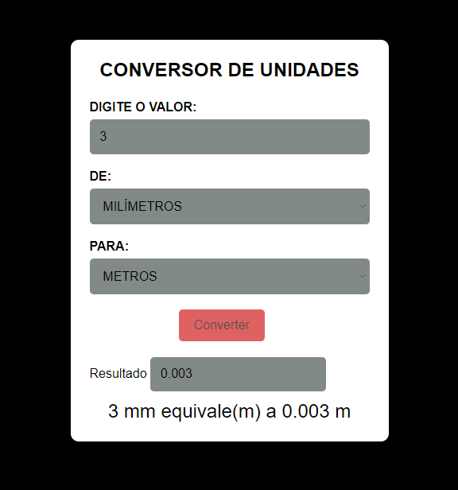

# CONVERSOR DE UNIDADES SIMPLES EM JS
---
> Projeto usando JS / HTML / CSS !

   O PROJETO TEM O OBJETIVO DE CONVERTER UNIDADES DE COMPRIMENTO !

   
   

   ###### Técnicas aplicadas:

   - Tags semânticas.
   - Primeira versão do projeto.
   - validação para entrada de valores positivos somente.

   
   Jorge Augusto - [linkedin](https://www.linkedin.com/in/jorgeaugusto88/)
